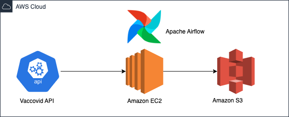

## Description

The main purpose of the project was to create airflow dag, that takes data out of API, clean it and save it to S3 bucket

## Tech stack

In this project I used:

- Amazon EC2 - used to store Apache Airflow

- Amazon S3 - used to store final version of the data

## Data pipeline

Steps:
- Dag set to run etl function 
- Function:
  1. Connect to API
  2. Put response data into json format
  3. Loop through response_json, using dictionary take only necessery data, put it into countries list
  4. Change data to pandas DF
  5. Save it as csv file on S3 Bucket

## Files

- etl_function.py -> Covers etl steps, which are triggered by Airflow
- etl_dag.py -> Code used in AWS EC2 instance in Airflow, to create and perform DAG

## Data source

API source: https://rapidapi.com/vaccovidlive-vaccovidlive-default/api/vaccovid-coronavirus-vaccine-and-treatment-tracker

